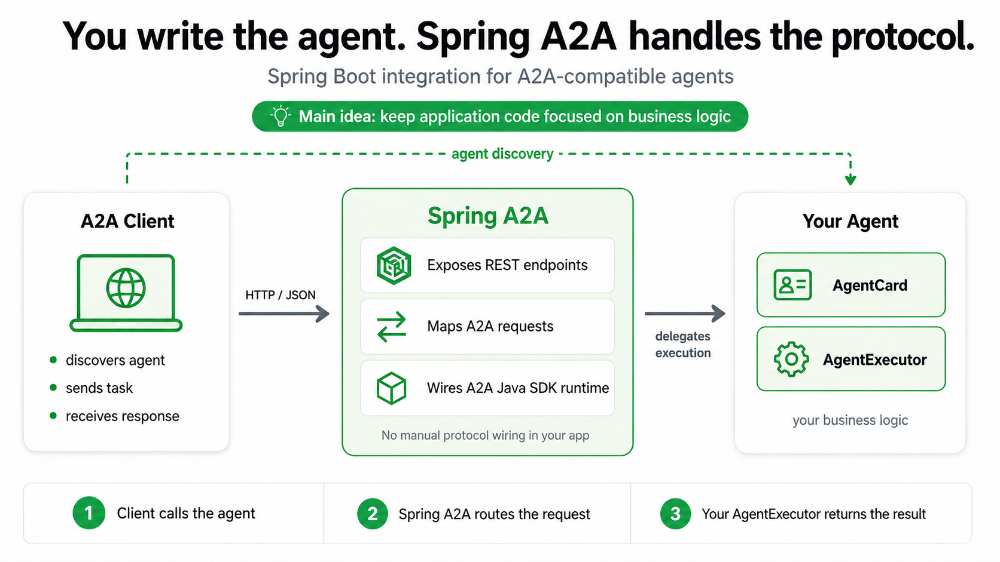

# Spring A2A

[](https://github.com/Sh1bari/spring-a2a/actions/workflows/build.yml)
[](https://github.com/Sh1bari/spring-a2a/actions/workflows/run-spring-boot-rest-tck.yml)
[](LICENSE)

Spring A2A provides Spring Boot auto-configuration, starter modules, and runnable examples for applications that communicate through the [Agent2Agent Protocol](https://a2a-protocol.org/) using the official [A2A Java SDK](https://github.com/a2aproject/a2a-java).

> **You implement the agent. Spring A2A handles the protocol integration.**

> [!IMPORTANT]
> The current implementation provides the **REST server integration**.
> REST client, JSON-RPC, and gRPC integrations are reserved for future work.

## What Is Spring A2A?

A2A defines how independent agents discover one another, exchange messages, execute tasks, and stream task updates.

The A2A Java SDK provides the protocol model and runtime abstractions.

Spring A2A connects those abstractions to Spring Boot by:

- configuring the A2A server runtime;
- exposing transport endpoints;
- publishing the agent card;
- delegating requests to application-defined agent logic;
- allowing runtime components to be replaced with custom Spring beans.

## Examples

The repository also includes runnable example applications alongside the libraries.

- [REST example](examples/spring-boot/rest/README.md) - the current transport example. It starts a server and a small browser-friendly web UI for exploring the REST flow end to end.

That example is the first fully documented example area. Additional transports will follow the same pattern with their own example index and runnable UI where needed.

## Source Of Truth

- [Documentation index](docs/README.md)
- [Compatibility](docs/compatibility.md)
- [Contributing](CONTRIBUTING.md)

## How It Works

<p align="center">
  
</p>

A server application provides two main components:

- `AgentCard` - describes the agent and its capabilities;
- `AgentExecutor` - implements the agent behavior.

Spring A2A configures the protocol infrastructure around them:

```text
A2A Client
    |
    | HTTP + JSON
    v
Spring MVC REST Transport
    |
    v
Spring A2A Auto-Configuration
    |
    v
A2A Java SDK Runtime
    |
    v
AgentCard + AgentExecutor
```

## Getting Started

### Requirements

- Java 17 or later
- Maven 3.9 or later

### Build From Source

```shell
git clone https://github.com/Sh1bari/spring-a2a.git
cd spring-a2a
mvn clean install
```

### Add The REST Server Starter

```xml
<dependency>
    <groupId>io.github.sh1bari</groupId>
    <artifactId>a2a-spring-boot-starter-server-rest</artifactId>
    <version>0.1.2</version>
</dependency>
```

### Define Your Agent

Provide an `AgentCard` bean and an `AgentExecutor` bean:

```java
@Configuration(proxyBeanMethods = false)
class AgentConfiguration {

    @Bean
    AgentCard agentCard() {
        // Describe the agent, its capabilities, skills, and interfaces.
    }

    @Bean
    AgentExecutor agentExecutor() {
        return new MyAgentExecutor();
    }

}
```

Spring Boot detects these beans, configures the A2A runtime, and exposes the REST transport automatically.

## Project Structure

```text
spring-a2a
|-- spring-boot
|   |-- server
|   |   |-- spring-boot-server-autoconfigure
|   |   `-- rest
|   |       |-- spring-boot-server-rest
|   |       |-- spring-boot-starter-server-rest
|   |       |-- spring-boot-server-integration-tests
|   |       `-- spring-boot-server-rest-sut
|   |-- client
|   |   `-- reserved for future Spring Boot client integration
|   |-- jsonrpc
|   |   `-- reserved for future JSON-RPC support
|   `-- grpc
|       `-- reserved for future gRPC support
|-- examples
|   `-- spring-boot
|       |-- rest
|       |   |-- server
|       |   `-- client
|       |-- jsonrpc
|       `-- grpc
|-- docs
`-- scripts
```

The JSON-RPC, gRPC, and Spring Boot client library modules currently reserve the intended project structure and do not yet represent completed integrations.

## Validation

There are two independent checks:

- `Build` verifies compilation and tests on Java 17, 21, and 25.
- `Spring Boot REST TCK` validates the REST server against the official A2A Technology Compatibility Kit.

To run the regular build locally:

```shell
mvn -B verify
```

To run the REST TCK locally:

```shell
bash ./scripts/run-spring-boot-rest-tck.sh
```

## Releases

Spring A2A releases are versioned, signed, and published in two places:

- Maven Central for dependency consumers;
- GitHub Releases for direct downloads of the same library artifacts.

Each release includes:

- the three library jars;
- matching `sources.jar` and `javadoc.jar` artifacts where the module has source code and published API docs;
- SHA-256 checksums for the GitHub Release assets.

Release process:

- build and test the project with `mvn -B verify`;
- publish the three libraries to Maven Central with the release script;
- create a GitHub Release for the same version tag.

Example release headline:

`Spring A2A 0.1.0`

## License

Spring A2A is released under the [Apache License 2.0](LICENSE).
