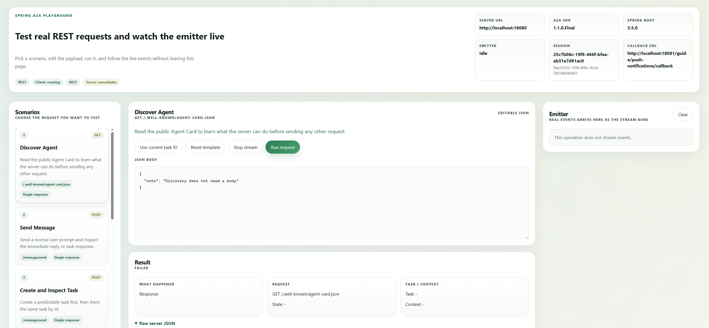

# A2A Spring Boot REST Client Example

This module contains the runnable client-side guide for the REST example.

## Interactive Guide

The client renders the browser guide at `GET /guide` and the playground at `GET /guide/playground`.

It shows:

- real HTTP calls from the client to the A2A server;
- editable JSON request templates;
- direct responses and task-based responses;
- task lookup, subscription, cancellation, and push-notification flows;
- live streaming events in the emitter panel;
- incoming push callbacks in a dedicated inbox.



## What To Expect

The client is not a second server implementation.
It is a browser-facing guide that:

- sends real A2A requests to the REST server example;
- stores the current browser session state on the client side;
- shows the raw server response in a readable format;
- keeps push callbacks in the current browser inbox.

## Run

Start the server example first:

```bash
mvn -pl examples/spring-boot/rest/server -am spring-boot:run
```

Then start the client example:

```bash
mvn -pl examples/spring-boot/rest/client -am spring-boot:run
```

The client starts on port `18081` by default.

## Configuration

Update the server URL in `src/main/resources/application.yml` if the A2A server runs on a different host or port.

## Build

```bash
mvn -pl examples/spring-boot/rest/client test
```
